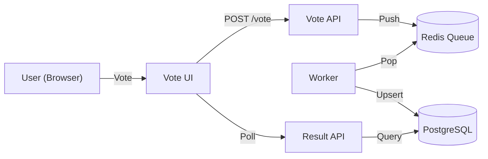
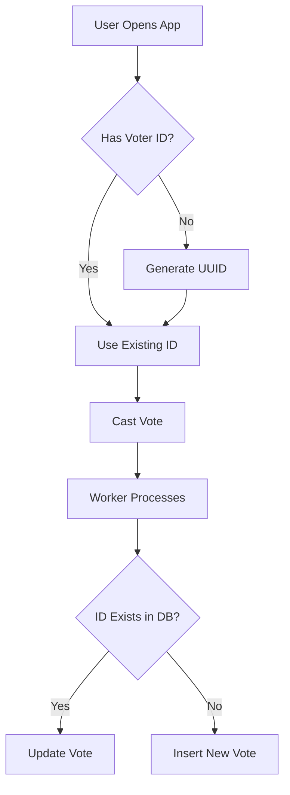

# Microvoting Platform

A cloud-native, production-grade implementation of a voting application, built with a microservices architecture and designed for deployment on Google Kubernetes Engine (GKE).

## 🚀 Overview

This project demonstrates a modern DevOps toolchain and microservices patterns. It allows users to vote for candidates, processes votes asynchronously, and displays real-time results.

**Key Features:**

- **Microservices Architecture**: Decoupled services for voting, processing, and results.
- **Asynchronous Processing**: Redis-based queuing for high throughput.
- **One Vote Per Device**: Ensures fair voting by restricting users to a single active vote per device.
- **Secured Administration**: Password-protected reset functionality.
- **Infrastructure as Code**: Terraform for GCP resource provisioning.
- **Kubernetes Orchestration**: Helm charts for deployment on GKE.
- **CI/CD**: GitHub Actions for automated testing and code quality checks.
- **Observability**: Prometheus and Grafana for monitoring.

## 🏗️ Architecture

The application consists of the following components:

1.  **Vote UI** (`app/vote-ui`): A React/Vite frontend where users cast votes.
2.  **Vote API** (`app/vote-api`): A FastAPI backend that receives votes and pushes them to a Redis queue.
3.  **Redis**: A message broker for buffering votes.
4.  **Worker** (`app/worker`): A Python worker that consumes votes from Redis and stores them in the database.
5.  **PostgreSQL**: A relational database for persistent storage of votes.
6.  **Result API** (`app/result-api`): A FastAPI backend that queries the database and serves vote counts.



## 🌟 Key Features Logic

### One Vote Per Device

To ensure fairness, the application enforces a "One Vote Per Device" policy.

- **Frontend**: Generates a unique UUID (`voter_id`) and stores it in the browser's `localStorage`.
- **Backend**: The `worker` uses an **UPSERT** (Update or Insert) strategy. If a vote already exists for a given `voter_id`, it updates the candidate instead of creating a new vote.



### Secured Reset

The ability to reset votes is protected to prevent unauthorized access.

- **Protection**: The `/reset` endpoint requires an `X-Admin-Key` header.
- **Password**: The default password is configured as `rivooq` (via the `ADMIN_KEY` environment variable).
- **UI**: Clicking "Reset" prompts the user for this password.

## 🛠️ Technology Stack

- **Frontend**: React, TypeScript, Vite, Tailwind CSS
- **Backend**: Python, FastAPI
- **Database**: PostgreSQL
- **Message Broker**: Redis
- **Infrastructure**: Terraform, Docker, Kubernetes (GKE), Helm
- **CI/CD**: GitHub Actions
- **Monitoring**: Prometheus, Grafana

## 🏁 Getting Started (Local Development)

You can run the entire stack locally using Docker Compose.

### Prerequisites

- [Docker](https://docs.docker.com/get-docker/)
- [Docker Compose](https://docs.docker.com/compose/install/)

### Steps

1.  **Clone the repository:**

    ```bash
    git clone https://github.com/shishirshetty77/microvoting-platform.git
    cd microvoting-platform
    ```

2.  **Start the application:**

    ```bash
    docker-compose up --build
    ```

3.  **Access the services:**

    - **Vote UI**: [http://localhost:3000](http://localhost:3000)
    - **Vote API**: [http://localhost:8080](http://localhost:8080)
    - **Result API**: [http://localhost:8081](http://localhost:8081)

4.  **Stop the application:**
    Press `Ctrl+C` or run:
    ```bash
    docker-compose down -v
    ```

## 🧪 Development Workflow

We use **GitHub Actions** for Continuous Integration.

### Code Quality Pipeline

The `code-quality.yml` workflow runs on every push to `main` and `dev`, and on pull requests. It performs:

- **Linting**: Checks code style using `flake8` (Python) and `eslint` (TypeScript).
- **Testing**: Runs unit tests using `pytest`.

To run checks locally:

**Vote API / Result API:**

```bash
# Install dependencies
pip install -r requirements.txt
# Run Linting
flake8 main.py
# Run Tests
python -m pytest tests/
```

**Vote UI:**

```bash
# Install dependencies
npm ci
# Run Linting
npm run lint
# Build
npm run build
```

## ☁️ Deployment (GCP)

For production deployment, we use Terraform to provision infrastructure and Helm to deploy the application.

### 1. Infrastructure (Terraform)

Navigate to `terraform/` and apply the configuration to create a GKE cluster and Artifact Registry.

```bash
terraform init
terraform apply -var="gcp_project_id=YOUR_PROJECT_ID"
```

### 2. Application (Helm)

Navigate to `charts/voting-app/` and deploy using Helm.

```bash
helm upgrade --install voting-app . \
  --namespace dev \
  --create-namespace \
  -f values-dev.yaml \
  --set global.imageRegistry=YOUR_REGION-docker.pkg.dev/YOUR_PROJECT_ID/voting-app-images
```

## 📊 Observability

The application exposes Prometheus metrics at `/metrics` endpoints.

- **Vote API**: Tracks total votes received.
- **Result API**: Tracks current vote counts.

If deployed with the monitoring stack, you can visualize these metrics in Grafana.

## 🤝 Contributing

1.  Fork the repository.
2.  Create a feature branch (`git checkout -b feature/amazing-feature`).
3.  Commit your changes (`git commit -m 'Add amazing feature'`).
4.  Push to the branch (`git push origin feature/amazing-feature`).
5.  Open a Pull Request.

---

_Built with ❤️ by the Microvoting Platform Team_
