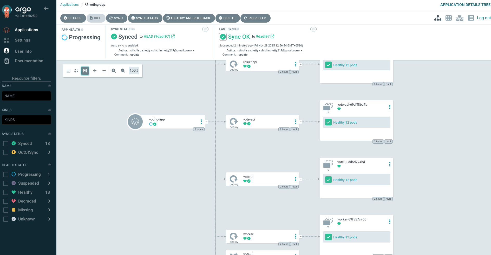
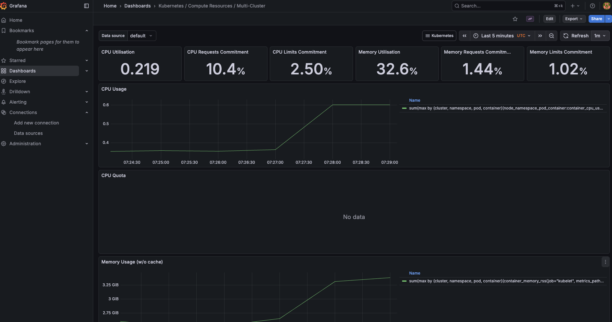

# Deployment Guide

This guide provides step-by-step instructions to set up a Kubernetes cluster, deploy the Microvoting Platform using **ArgoCD (GitOps)**, implement a **Rolling Update** strategy, and configure a complete **Monitoring Stack** (Prometheus, Grafana, Loki).

## Prerequisites

Ensure you have the following tools installed:

- [Docker](https://docs.docker.com/get-docker/)
- [Kind](https://kind.sigs.k8s.io/docs/user/quick-start/#installation)
- [Kubectl](https://kubernetes.io/docs/tasks/tools/)
- [Helm](https://helm.sh/docs/intro/install/)
- [ArgoCD CLI](https://argo-cd.readthedocs.io/en/stable/cli_installation/) (Optional but recommended)

---

## 1. Cluster Setup

Create a new Kubernetes cluster using Kind (or use an existing cluster like EKS/GKE/EC2).

```bash
kind create cluster --name microvoting
```

Verify the cluster is running:

```bash
kubectl cluster-info --context kind-microvoting
```

---

## 2. GitOps with ArgoCD

We use ArgoCD to manage the application deployment automatically from Git.

### Install ArgoCD

1.  Create the namespace:
    ```bash
    kubectl create namespace argocd
    ```
2.  Install ArgoCD:
    ```bash
    kubectl apply -n argocd -f https://raw.githubusercontent.com/argoproj/argo-cd/stable/manifests/install.yaml
    ```

### Access ArgoCD UI

1.  **Get the Admin Password:**
    ```bash
    kubectl -n argocd get secret argocd-initial-admin-secret -o jsonpath="{.data.password}" | base64 -d; echo
    ```
2.  **Port Forward:**
    ```bash
    kubectl port-forward svc/argocd-server -n argocd 8080:443
    ```
3.  **Login:**
    - URL: [https://localhost:8080](https://localhost:8080)
    - User: `admin`
    - Password: (Output from step 1)



### Deploy Application

Apply the ArgoCD Application manifest to deploy the voting app:

```bash
kubectl apply -f argocd-app.yaml
```

ArgoCD will now sync the `charts/voting-app` from your GitHub repository to the `voting` namespace.

---

## 3. Deployment Strategy (Rolling Update)

The application is configured with a **Rolling Update** strategy to ensure zero downtime during updates.

### Configuration

The `deployment.yaml` files include:

```yaml
strategy:
  type: RollingUpdate
  rollingUpdate:
    maxSurge: 25%
    maxUnavailable: 25%
```

### Verifying an Update

1.  Change `replicaCount` in `charts/voting-app/values.yaml` (e.g., to 6).
2.  Push the change to GitHub.
3.  Watch the pods update one by one:
    ```bash
    kubectl get pods -n voting -w
    ```

---

## 4. Monitoring Stack Setup (PLG Stack)

We use Prometheus (Metrics), Loki (Logs), and Grafana (Visualization).

### Install via Helm

```bash
# Add Repos
helm repo add prometheus-community https://prometheus-community.github.io/helm-charts
helm repo add grafana https://grafana.github.io/helm-charts
helm repo update

# Create Namespace
kubectl create namespace monitoring

# Install Prometheus & Grafana
helm install prometheus prometheus-community/kube-prometheus-stack --namespace monitoring

# Install Loki & Promtail
helm install loki grafana/loki-stack --namespace monitoring --set grafana.enabled=false,loki.isDefault=false
```

### Access Grafana

1.  **Get Admin Password:**

    ```bash
    kubectl get secret --namespace monitoring prometheus-grafana -o jsonpath="{.data.admin-password}" | base64 --decode ; echo
    ```

2.  **Port Forward:**
    To access on port **3001** (accessible from any IP):

    ```bash
    kubectl port-forward svc/prometheus-grafana -n monitoring 3001:80 --address 0.0.0.0
    ```

3.  **Login:**
    - URL: `http://<YOUR-IP>:3001`
    - User: `admin`
    - Password: (Output from step 1)



### Dashboards & Logs

- **Cluster Metrics:** Go to **Dashboards** -> **Browse** -> **Kubernetes / Compute Resources / Cluster**.
- **Application Logs:** Go to **Explore** -> Select **Loki** datasource -> Run query `{namespace="voting"}`.

---

## 5. Teardown & Restoration

### Stopping to Save Costs

To stop billing for your cloud instance (EC2/GCP):

1.  **Stop the Instance:**
    - **GCP:** `gcloud compute instances stop <INSTANCE_NAME> --zone <ZONE>`
    - **AWS:** Go to EC2 Console -> Select Instance -> Instance State -> **Stop**.

### Restoring Everything

When you start the instance again, Kubernetes might be empty (if it was a temporary cluster) or paused. To bring the full stack back up:

1.  **Start the Instance:**

    - **GCP:** `gcloud compute instances start <INSTANCE_NAME> --zone <ZONE>`

2.  **Re-Install ArgoCD:**

    ```bash
    kubectl create namespace argocd
    kubectl apply -n argocd -f https://raw.githubusercontent.com/argoproj/argo-cd/stable/manifests/install.yaml
    ```

3.  **Re-Deploy App:**

    ```bash
    kubectl apply -f argocd-app.yaml
    ```

4.  **Re-Install Monitoring:**
    ```bash
    kubectl create namespace monitoring
    helm install prometheus prometheus-community/kube-prometheus-stack --namespace monitoring
    helm install loki grafana/loki-stack --namespace monitoring --set grafana.enabled=false,loki.isDefault=false
    ```

---

## 6. Troubleshooting

**"Too many open files" Error in Promtail:**
If Promtail crashes, increase file watch limits on the node:

```bash
sudo sysctl -w fs.inotify.max_user_instances=512
sudo sysctl -w fs.inotify.max_user_watches=524288
```
