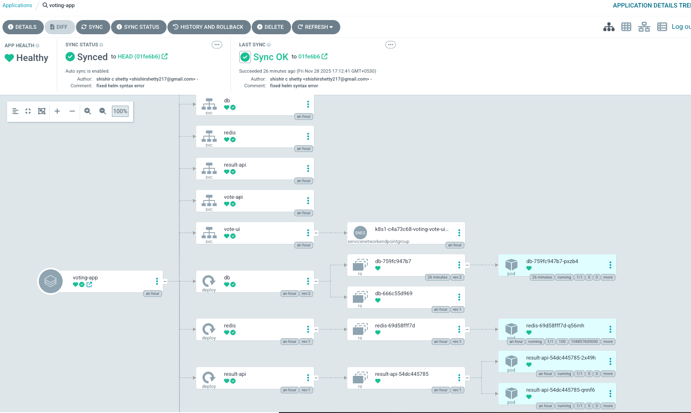
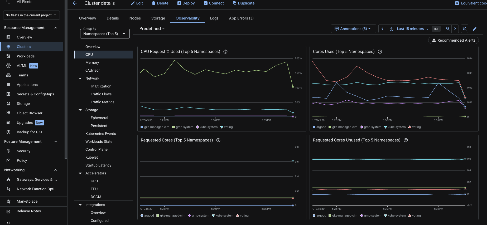
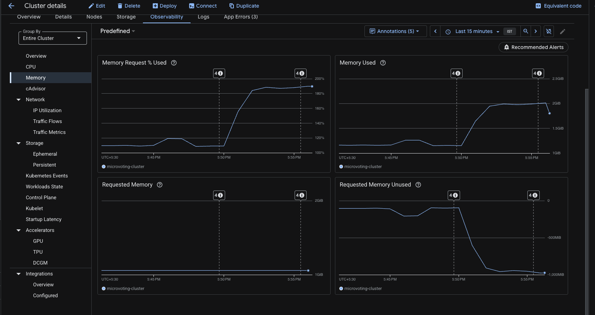

# GKE Deployment & Monitoring Guide

This document details the complete process for deploying the **Microvoting Platform** on **Google Kubernetes Engine (GKE)** using **Terraform** for infrastructure and **ArgoCD** for GitOps deployment. It also covers setting up **Google Cloud Native Monitoring**.

## 1. Prerequisites

Ensure you have the following tools installed:

- `gcloud` CLI
- `kubectl`
- `terraform`
- `git`

**Credentials:**

- GCP Project ID: `cloud-explore-478521`
- Service Account Key: `/Users/rivooq/Desktop/iasaccount-key.json`

---

## 2. Infrastructure as Code (Terraform)

We use Terraform to provision the VPC, Subnets, and GKE Cluster.

### Files

- `terraform/main.tf`: Defines the VPC (`voting-vpc`) and Subnet (`voting-subnet`).
- `terraform/gke.tf`: Defines the Zonal GKE Cluster (`microvoting-cluster`) and Node Pool (`microvoting-node-pool`).
  - **Cost Optimization:** Uses `e2-medium` **Spot Instances** (Preemptible) to minimize costs.
  - **Monitoring:** Enables `monitoring.googleapis.com/kubernetes` and `logging.googleapis.com/kubernetes`.
- `terraform/variables.tf`: Configuration for Project ID (`cloud-explore-478521`) and Region (`asia-south1`).

### Commands to Provision

1.  **Initialize Terraform:**
    ```bash
    cd terraform
    terraform init
    ```
2.  **Plan Changes:**
    ```bash
    terraform plan
    ```
3.  **Apply Changes:**
    ```bash
    terraform apply -var="project_id=cloud-explore-478521"
    ```
    _(Type `yes` to confirm)_

### Handling Existing Resources

If resources (like the VPC) already exist, import them into Terraform state:

```bash
terraform import google_compute_network.vpc projects/cloud-explore-478521/global/networks/voting-vpc
terraform import google_compute_subnetwork.subnet projects/cloud-explore-478521/regions/asia-south1/subnetworks/voting-subnet
terraform import google_container_cluster.primary projects/cloud-explore-478521/locations/asia-south1-a/clusters/microvoting-cluster
```

---

## 3. Connecting to the Cluster

Once the cluster is ready, configure `kubectl` to connect to it:

```bash
gcloud auth activate-service-account --key-file=/Users/rivooq/Desktop/iasaccount-key.json
gcloud container clusters get-credentials microvoting-cluster --zone asia-south1-a --project cloud-explore-478521
```

Verify connection:

```bash
kubectl get nodes
```

---

## 4. ArgoCD Setup (GitOps)

We use ArgoCD to manage the application deployment.

### Installation

1.  **Create Namespace:**
    ```bash
    kubectl create namespace argocd
    ```
2.  **Install Manifests:**
    ```bash
    kubectl apply -n argocd -f https://raw.githubusercontent.com/argoproj/argo-cd/stable/manifests/install.yaml
    ```

### Accessing ArgoCD UI

1.  **Get Admin Password:**
    ```bash
    kubectl -n argocd get secret argocd-initial-admin-secret -o jsonpath="{.data.password}" | base64 -d; echo
    ```
2.  **Port Forward:**
    ```bash
    kubectl port-forward svc/argocd-server -n argocd 8080:443 --address 0.0.0.0
    ```
3.  **Login:** Open `https://localhost:8080` (User: `admin`).



### Deploying the App

We use the `argocd-app.yaml` manifest to tell ArgoCD to sync the `charts/voting-app` directory from GitHub.

**Configuration (`argocd-app.yaml`):**

- **Auto-Sync:** Enabled (`automated: { prune: true, selfHeal: true }`).
- **Repo:** `https://github.com/shishirshetty77/microvoting-platform.git`

**Apply Configuration:**

```bash
kubectl apply -f argocd-app.yaml
```

---

## 5. Application Access

The application uses an **Ingress** to expose the UI.

1.  **Get External IP:**

    ```bash
    kubectl get ingress -n voting
    ```

    _(Look for the `ADDRESS` column, e.g., `34.110.137.69`)_

2.  **Access Vote UI:**
    Open `http://<EXTERNAL-IP>` in your browser.

---

## 6. Monitoring & Logging (GCP Native)

We enabled **Google Cloud Operations Suite** (Stackdriver) in Terraform.

### Accessing Dashboards

1.  Go to **Google Cloud Console**.
2.  Navigate to **Kubernetes Engine** > **Clusters**.
3.  Click on `microvoting-cluster`.
4.  **Metrics:** Click the **Observability** tab to see CPU, Memory, and Disk usage charts.
5.  **Logs:** Click the **Logs** tab to view container logs (stdout/stderr) and system logs.





**Benefits:**

- No need to manage Prometheus/Grafana pods.
- Zero maintenance.
- Built-in integration with GKE.

---

## 7. Troubleshooting

### Postgres `CrashLoopBackOff` (initdb error)

- **Issue:** Postgres fails to start with `initdb: directory ... exists but is not empty` due to `lost+found` folder on GKE PVCs.
- **Fix:** Set the `PGDATA` environment variable to a subdirectory.
  ```yaml
  env:
    - name: PGDATA
      value: /var/lib/postgresql/data/pgdata
  ```

### Vote Failed (503 Service Unavailable)

- **Issue:** `vote-api` cannot connect to Redis.
- **Fix:** Ensure `REDIS_HOST` env var matches the service name (`redis`). If correct, restart `vote-api` pods to clear stale connections:
  ```bash
  kubectl rollout restart deployment vote-api -n voting
  ```
